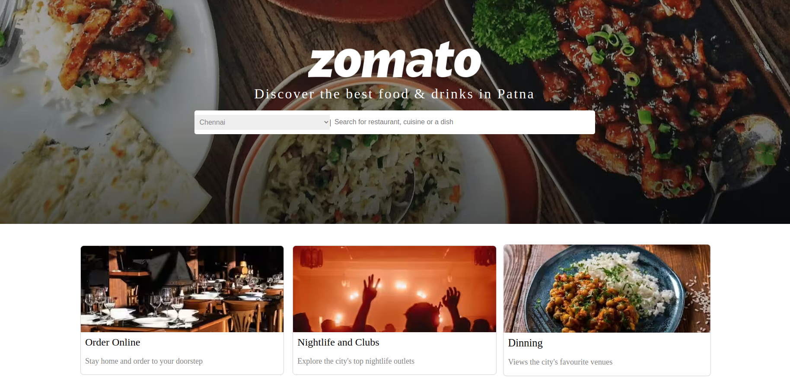

# 🍽️ **Zomato Clone: DevSecOps CI/CD**  
 

🚀 **A full-stack Zomato Clone with DevSecOps integration for a secure and scalable deployment.**  


 

## 🔹 **Key Features:**  

✅ **User-friendly UI** – Interactive menu, checkout, and order tracking.  
✅ **Secure DevOps Pipeline** – CI/CD automation with security checks.  
✅ **Optimized Deployment** – Uses containerization & cloud hosting.  
✅ **React.js-Based Frontend** – Built with Create React App.  
✅ **Production-Ready** – Includes build optimizations & best practices.  


---

### 🔧 **Prerequisites**  

Ensure you have **Node.js** and **npm** installed.  

```sh
node -v   # Check Node.js version
npm -v    # Check npm version
```

### 📦 **Installation**  

Clone the repository and install dependencies:  

```sh
git clone https://github.com/22lavanyas/zomato-clone.git
cd zomato-clone  
npm install  
```

### 🚀 **Running the App**  

Start the development server:  

```sh
npm start  
```

🔗 Open [http://localhost:3000](http://localhost:3000) in your browser.  

---

## 📜 **Available Scripts**  

| Command | Description |  
|---------|------------|  
| `npm start` | Runs the app in development mode |  
| `npm test` | Launches the test runner |  
| `npm run build` | Builds the app for production |  
| `npm run eject` | Ejects the default configuration (irreversible) |  

For more details, check the [Create React App documentation](https://facebook.github.io/create-react-app/docs/getting-started).  

---

## 🚢 **Deployment**  

### 🔥 **Build for Production**  

```sh
npm run build  
```

📂 The app is built in the `build/` folder, ready for deployment.   
 
---

## 🤝 **Contributing**  

Contributions are welcome! If you'd like to improve this project, feel free to submit a pull request.  

---

### 📧 **Connect with me:**

[](https://www.linkedin.com/in/22lavanya/) [](hhttps://github.com/22lavanyas)[](https://x.com/22lavanya11)

---

### 🎉 **Happy Coding!** 🚀  
